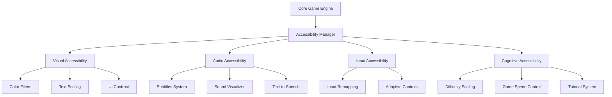

# Succès débloqué : Rendre son jeu vidéo accessible

## Comment faire ?

### Architecture modulaire

### Référentiels et Guidelines
- [Xbox Accessibility Guidelines](https://docs.microsoft.com/en-us/gaming/accessibility/xbox-accessibility-guidelines)
- [Games Accessibility Guidelines](http://gameaccessibilityguidelines.com/)
- [Accessible Player Experiences (APX)](https://accessible.games/)
- [XR Accessibility User Requirements](https://www.w3.org/TR/xaur/)
- [SIG Guidelines](https://igda-gasig.org/get-involved/sig-initiatives/resources-for-game-developers/sig-guidelines/)
- [Creating Accessible Packaging](https://packagingandcontent.blob.core.windows.net/accessibility/Creating-Accessible-Packaging.pdf)
- [Tags and requirements](https://accessiblegames.com/wp-content/uploads/2025/03/Accessible-Games-Initiative-Tags-and-Criteria-March-2025.pdf)

### Formations
- [Accessible Design with Unreal Engine](https://dev.epicgames.com/community/learning/courses/7M1/accessible-design-with-unreal-engine/yGwl/accessible-design-in-unreal-engine-overview)
- [Microsoft Learn : Gaming accessibility fundamentals](https://learn.microsoft.com/en-us/training/paths/gaming-accessibility-fundamentals/)
- [Certified APX Practitioner Course](https://accessible.games/certified-apx-practitioner-course/)
- [Accessibilité et Production de Jeu Vidéo, Approche Neuroinclusive](https://bertieformation.catalogueformpro.com/2/design/1955970/accessibilite-et-production-de-jeu-video-approche-neuroinclusive)
- [Video Game Accessibility](https://abilitynet.org.uk/training/video-game-accessibility)
- [Practical Game Accessibility](https://learn.unity.com/course/practical-game-accessibility)
- [Adaptive Gaming - Makers Making Change](https://www.makersmakingchange.com/s/adaptive-gaming)

### Outils de Développement et logiciels
- [Unity Accessibility Plugin](https://github.com/mikrima/UnityAccessibilityPlugin)
- [Microsoft Game Accessibility Testing Service (MGATS)](https://learn.microsoft.com/en-us/gaming/accessibility/mgats)
- [Ubisoft’s Colorblind Simulation Tool, Chroma](https://github.com/ubisoft/Chroma)
- [SensePilot](https://sensepilot.tech/)
- [Play Ability](https://www.playability.gg/fr)

### Intégration Continue
- **CI/CD** : Utilisation de services comme Jenkins, Travis CI, ou GitHub Actions pour automatiser les tests d’accessibilité.

## Communautés
### Organisations et initiatives
- [Able Gamers](https://ablegamers.org/)
- [CapGame](https://capgame.fr/)
- [Special Effect](https://www.specialeffect.org.uk/)
- [Game'Her](https://gameher.fr/)
- [Can I play that?](https://caniplaythat.com/)
- [Able to play](https://abletoplay.com/)
- [Game Accessibility Nexus](https://www.gameaccessibilitynexus.com/)
- [Accessibility Unlocked](https://www.accessunlocked.games/)
- [Game Lover](https://www.game-lover.org/)
- [Acessible Game Initiative](https://accessiblegames.com/)

### Reddit et discord
- [r/accessiblegaming](https://www.reddit.com/r/accessiblegaming/)
- [Game Accessibility (IGDA-GASIG)](https://discord.gg/ZEtgxJFbqu)

### Conférences et événements
- [GAConf](https://www.gaconf.com/)
- [JAMTL/Conf](https://www.linkedin.com/company/jamtl-conf/)
- [#a11yTO Gaming](https://gaming.a11yto.com/)
- [XR Access](https://xraccess.org/)
- [Nothing Without Us](https://www.nothingwithoutus.co.uk/)
