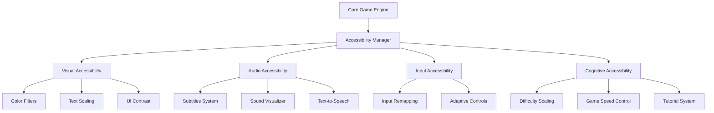

# Succès débloqué : Rendre son jeu vidéo accessible

## Comment faire ?

### Architecture modulaire

### Référentiels et Guidelines
- [Xbox Accessibility Guidelines](https://docs.microsoft.com/en-us/gaming/accessibility/xbox-accessibility-guidelines)
- [Games Accessibility Guidelines](http://gameaccessibilityguidelines.com/)
- [Accessible Player Experiences (APX)](https://accessible.games/)

### Formations
- [Accessible Design with Unreal Engine](https://dev.epicgames.com/community/learning/courses/7M1/accessible-design-with-unreal-engine/yGwl/accessible-design-in-unreal-engine-overview)
- [Microsoft Learn : Gaming accessibility fundamentals](https://learn.microsoft.com/en-us/training/paths/gaming-accessibility-fundamentals/)

### Outils de Développement
- [Unity Accessibility Plugin](https://github.com/mikrima/UnityAccessibilityPlugin)
- [Microsoft Game Accessibility Testing Service (MGATS)](https://learn.microsoft.com/en-us/gaming/accessibility/mgats)

### Intégration Continue
- **CI/CD** : Utilisation de services comme Jenkins, Travis CI, ou GitHub Actions pour automatiser les tests d’accessibilité.

